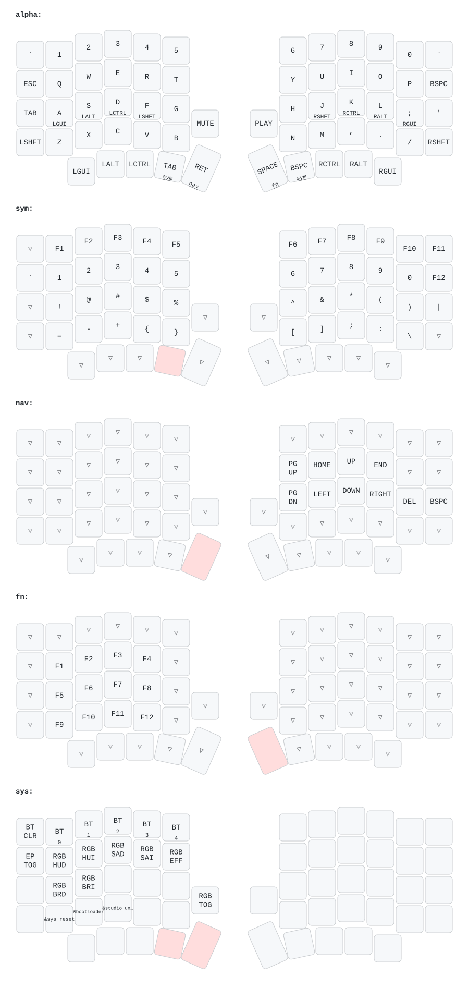

# zmk-config

ZMK firmware config for a **Sofle Choc Pro**. See [`CLAUDE.md`](CLAUDE.md) for the full repo architecture, build setup, and my hardware notes (nice!view displays, no rotary encoders). This file just describes the current keymap.

## Layout at a glance

Six layers, defined in [`config/sofle_choc_pro.keymap`](config/sofle_choc_pro.keymap). `NUM`, `SYM`, and `NAV`/`FN` are reachable via thumb layer-tap keys; holding `SYM`+`NAV` together auto-activates `SYS`.

- **alpha (QWERTY)** — standard US-ANSI-ish letters/numbers, close to a stock keyboard so it stays easy to switch back and forth with the MacBook keyboard. Left thumb row: `GUI ALT CTRL NUM/TAB NAV/ENTER`; right thumb row: `FN/SPACE SYM/BSPC CTRL ALT GUI`. A `MUTE`/`PLAY` pair sits in the top-right corner of each half's inner column. Home-row mods on `A S D F` / `J K L ;` mirror the thumb-key order (`GUI ALT CTRL SHIFT`, pinky→index on the left, mirrored on the right) — hold for the modifier, tap for the letter. Tuned as balanced hold-taps restricted to cross-hand key presses (via `hold-trigger-key-positions`) so same-hand rolls like `as` or `fr` resolve as taps, not accidental modifiers. The left thumb's innermost/next-out keys tap `ENTER`/`TAB` and hold for `NAV`/`NUM`; the right thumb's innermost/next-out keys tap `SPACE`/`BSPC` and hold for `FN`/`SYM`. These are also balanced hold-taps, so a genuine hold (not just fast rollover into the next key) is required to activate the layer — the trade-off is that holding `ENTER`/`SPACE`/`TAB`/`BSPC` no longer auto-repeats via the OS.
- **num (NUMBER)** — held via the left thumb (`TAB`), numbers typed with the free right hand. Numpad-style, shifted onto the index finger's home column: `7 8 9` on the top row, `4 5 6` on the home row, `1 2 3` on the bottom row, `0` next to the `3`. The freed column and the column right of the numbers carry `, .` (at the `H`/`N` positions) and `+ -` (at the `;`/`P` positions). Left half unused.
- **sym (SYMBOL)** — held via the right thumb (`BSPC`), symbols typed with the free left hand. Each row's index/center columns hold one bracket pair — `()`, `[]`, `{}`, `<>` top to bottom by frequency — with the remaining symbols (`` ` ``, `!@#$%^&*`, `=-+`, `;:\|`) filling the rest. Right half unused.
- **nav (NAV)** — held via the left thumb (`ENTER`). Arrow keys and `HOME`/`END`/`PGUP`/`PGDN`/`DEL`/`BSPC` under the right hand for navigation. Left half is all `&trans`, so the home-row mods fall through from `alpha` unchanged (e.g. hold `D` for `CTRL` + tap an arrow key) — no other bindings on the left half.
- **fn (FUNCTION KEYS)** — held via the right thumb (`SPACE`), in place of `nav`. `F1`–`F12` on the left hand in three rows of four, starting at the `Q` position: `Q W E R`=`F1-F4`, `A S D F`=`F5-F8`, `Z X C V`=`F9-F12`. Right half unused.
- **sys (RGB/POWER/SYSTEM)** — held-together layer for things touched rarely: RGB hue/saturation/brightness/effect controls, `ext_power` toggle, `sys_reset`, `bootloader`, and `studio_unlock` on the left half; right half is unused (`&none`). Bluetooth profile select/clear (`BT_SEL 0-4`, `BT_CLR`) also lives here (top row).

Full per-key detail: see the diagram below, or read the ASCII-art banners above each layer's `bindings` block in the `.keymap` file itself — those are kept in sync with the actual bindings and are the fastest way to check an exact key.

## Diagram



A print-friendly version is at [`docs/sofle_choc_pro-keymap.pdf`](docs/sofle_choc_pro-keymap.pdf).

Both are generated from the actual `.keymap` + physical layout devicetree via [keymap-drawer](https://github.com/caksoylar/keymap-drawer), so they can't drift from the real bindings. To regenerate after editing the keymap:

```sh
./docs/generate-keymap-diagram.sh
```

This creates a throwaway Python venv (`.venv-keymap-drawer/`, gitignored) with `keymap-drawer` installed, and uses `rsvg-convert` (`brew install librsvg`) for the PDF if it's available.
